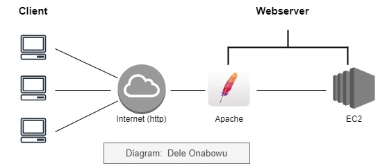
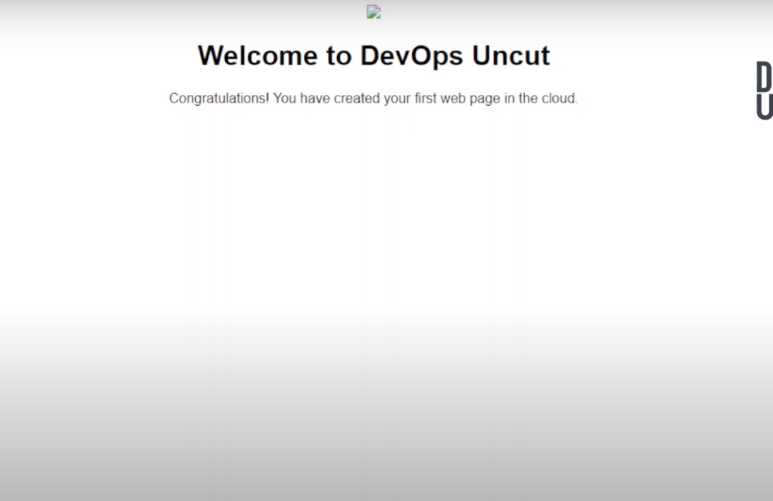

### Our goal is to launch a static website using an Amazon EC2 instance.



### LAUNCH A WEB PAGE ON AN EC2 INSTANCE IN THE CLOUD

1. Go to aws.amazon.com and register for an account.

2. We shall spin an EC2 virtual machine.

3. Log into our machine via SSH and install Apache

4. create our sample html page index.html

5. Navigate to /var/www/html folder and create our index.html file here

6. Go to our browser and use the public IP address of our EC2 instance to view our web page


### 1. CREATE AWS ACCOUNT 

- Create and sign in to your AWS Console

Go to the AWS Management Console (https://aws.amazon.com/).
Sign in using your AWS account credentials.

### 2.  LAUNCH EC2 INSTANCE

Once you're logged in, navigate to the EC2 dashboard by clicking on the "Services" menu at the top of the page.
Under the "Compute" section, select "EC2."


configure the EC2 Instance

- Name your Instance - Give it a meaningful name e.g my-ec2-server

- Choose an Amazon Machine Image (AMI) that runs Ubuntu. 


- Choose an Instance type of t2.micro as this is on the free tier and would not be charged.

- Create Keypair .  The private key will be downloaded to your machine on creation.

--Give your keypair a meaningful name e.g my-ec2-keypair
-- select options RSA and Pem
-- create keypair


- Configure Security Group.

 Go to the security tab for the instance
 Click on the security group
 Go to the inbound rules of the Instance and open up the following ports.
 Port 22 - To allow us to log into the instance via SSH to install Apache.
 


Click on the "Launch Instance" button to create a new EC2 instance.


### 3. Log into the EC2 Instance via SSH and install Apache

- Once the instance is running, select it from the EC2 Dashboard.
Click on the "Connect" button to get the SSH connection details.
Use the provided SSH command to connect to your EC2 instance e.g 
ssh -i /path/to/your/keypair.pem ubuntu@your_ec2_public_ip


- Copy the command to connect to your EC2 instance via SSH 


- Navigate to the directory on you local machine where your private key is located and run the command 
ssh -i /path/to/your/keypair.pem ubuntu@your_ec2_public_ip


Now we have successfully logged into our instance


Install Apache Server on Ubuntu

-Once connected to the EC2 instance via SSH, update the package index by running:

```
sudo apt update
```
- Install the Apache web server by running:
```
sudo apt install apache2 -y

```

 confirm that Apache is running
```
sudo systemctl status apache2
```
###  4. Create a Simple HTML Web Page

Apache serves web pages from /var/www/html/
We need to create index.html in this directory


```
<!DOCTYPE html>
<html lang="en">
<head>
<title>Page Title</title>
<meta charset="UTF-8">
<meta name="viewport" content="width=device-width, initial-scale=1">
<style>
body {
  font-family: Arial, Helvetica, sans-serif;
}
</style>
</head>
<body>
<center><image src="images/devops-uncut-logo-300.jpg"></center>
<center><h1>Welcome to DevOps Uncut</h1></center>
<p><center>Congratulations! You have created your first web page in the cloud.</center></p>

</body>
</html>

```

### 5. Navigate to /var/www/html/ and create index.html there

- navigate to /var/www/html/
```
cd /var/www/html
```
- when inside /var/www/html/ folder . list the files there

```
ls
```
- It will contain the default apache index.html page
- remove the page so that we can replace with ours

```
sudo rm index.html
```
- Once removed, we can create ours to replace the default page


### 6. Create our index.html file in /var/www/html/
- Use your favorite text editor (e.g., nano or vim) to create an index.html 
```
sudo vi index.html
```

- Copy and paste your html code into index.html 

```
<!DOCTYPE html>
<html lang="en">
<head>
<title>Page Title</title>
<meta charset="UTF-8">
<meta name="viewport" content="width=device-width, initial-scale=1">
<style>
body {
  font-family: Arial, Helvetica, sans-serif;
}
</style>
</head>
<body>
<center><image src="images/devops-uncut-logo-300.jpg"></center>
<center><h1>Welcome to DevOps Uncut</h1></center>
<p><center>Congratulations! You have created your first web page in the cloud.</center></p>

</body>
</html>

```

- Save by using command :wq!

- After pasting, save with
```
:wq!
```


### 7. View our web page in the browser

- Log into the console, go to your instance, navigate to the details tab and copy the public IP address of that instance.
- Paste the public IP in your browser and enter
- As expected, you will get a timeout error
This is because we have not opened Port 80 to allow http traffic to our instance
- Go to our instance security tab , go to security group and editthe inbound rules.

- Add a new rule and select http. This is port 80 by default
- Set the CIDR block to 0.0.0.0/0 to allow access from everywhere.


- Go back to the browser and refresh the page or enter the instance public IP address again.

- We should now see our web page in the browser



SUCCESS!!!!

The final thing is to delete our instance to avoid incurring unexpected costs

- Go to the console
- Select the instance
- Select Action
- Terminate Instance


