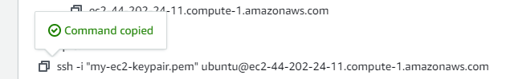

Our goal is to launch a static website using an Amazon EC2 

### LAUNCH A WEB PAGE ON AN EC2 INSTANCE IN THE CLOUD

1. Go to aws.amazon.com and register for an account.

2. We shall spin an EC2 virtual machine.

3. Log into our machine via SSH and install Apache

4. create our sample html page index.html

5. Navigate to /var/www/html folder and create our index.html file here

6. Go to our browser and use the public IP address of our EC2 instance to view our web page


### CREATE AWS ACCOUNT 

#### 1. Create and sign in to your AWS Console

Go to the AWS Management Console (https://aws.amazon.com/).
Sign in using your AWS account credentials.

#### 2. Navigate to EC2 Dashboard

Once you're logged in, navigate to the EC2 dashboard by clicking on the "Services" menu at the top of the page.
Under the "Compute" section, select "EC2."

- Name your Instance
- Choose an Amazon Machine Image (AMI) that runs Ubuntu. 
- Choose an Instance type of t2.micro as this is on the free tier and would not be charged.
- Create Keypair .  The private key will be downloaded to your machine on creation.
- Configure Security Group.

 Go to the security tab for the instance
 Click on the security group
 Go to the inbound rules of the Instance and open up the following ports.
 Port 22 - To allow us to log into the instance via SSH to install Apache.
 Port 80 - To allow http access to our instance through the Instance's public IP address.

- Click "Launch Instances."

3. Launch an EC2 Instance


Click on the "Launch Instance" button to create a new EC2 instance.


### Access the EC2 Instance via SSH

Once the instance is running, select it from the EC2 Dashboard.
Click on the "Connect" button to get the SSH connection details.
Use the provided SSH command to connect to your EC2 instance e.g 
ssh -i /path/to/your/keypair.pem ubuntu@your_ec2_public_ip


-------------------------------


####  Navigate to the directory on you local machine where your private key is located



#### Install Apache Server on Ubuntu

Once connected to the EC2 instance via SSH, update the package index by running:

#### Update the package index
```
sudo apt update
```
#### Install the Apache web server by running:

sudo apt install apache2 -y


9.  Create a Simple HTML Web Page
Apache serves web pages from /var/www/html/
We need to create index.html in this directory

Use your favorite text editor (e.g., nano or vim) to create an index.html file with the 
with the following content:

```
<!DOCTYPE html>
<html lang="en">
<head>
<title>Page Title</title>
<meta charset="UTF-8">
<meta name="viewport" content="width=device-width, initial-scale=1">
<style>
body {
  font-family: Arial, Helvetica, sans-serif;
}
</style>
</head>
<body>
<center><image src="images/devops-uncut-logo-300.jpg"></center>
<center><h1>Welcome to DevOps Uncut</h1></center>
<p><center>Congratulations! You have created your first web page in the cloud.</center></p>

</body>
</html>

```

10. Open a web browser and enter your EC2 instance's public IP address or public DNS hostname in the address bar.


